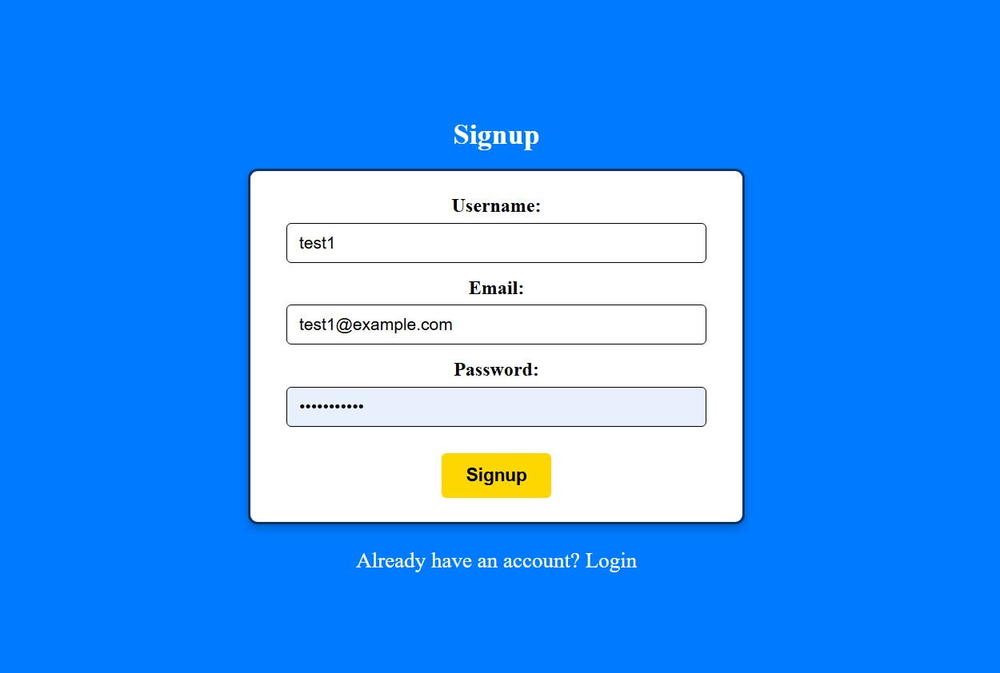
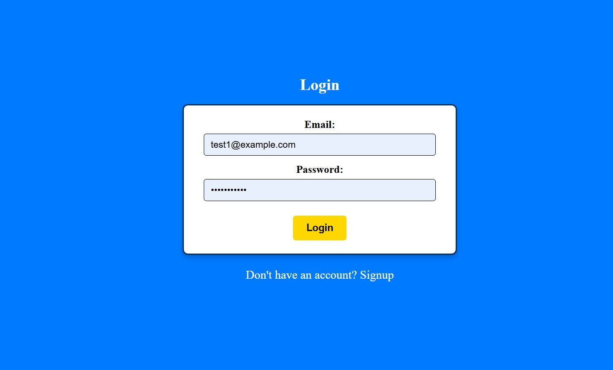

# COMP 3133 Assignment 2
Created by Adam Simcoe - 101442161

Last Updated - April 4th, 2025

---

## App Purpose
This fullstack application uses a Node.js Express backend and an Angular frontend to provide users with a comprehensive employee management system.

Key features of this app include:

- User Signup and Login functionality with session-based authentication
- Role protected access to employee data
- CRUD operations for employees
-Integrated GraphQL API for data fetching
- Real-time form validation with user-friendly error feedback
- Live search and filtering of employee records based off department and/or designation
- Employee photo previews

---

## How to Setup and Run the App

### Backend Setup
To start, first find the file `.env.example` within the root directory of the project. Then, copy and rename it to `.env`. This is necessary in order to perform the next step. You can either perform this manually or through the CLI with the following command in your root directory:

```bash
cp .env.example .env
```

Afterwards, run the following Docker command in the root directory to initialize and start your Docker containers using Docker Desktop:

```bash
docker-compose -p comp3133-assignment2 up --build -d
```

### Frontend Setup 
Navigate to frontend/employee-management and run the following command in order to install all necessary dependencies:

```bash
npm install
```
If you have never used Angular CLI before on your device, please run the following command in your terminal in order to be able to run the application. If you have used Angular before, you can skip this step:

```bash
npm install -g @angular/cli
```

Finally, within the employee-management directory run the following command in order to start the Angular application:

```bash
ng serve
```

### Viewing the Application
In order to view the application in your browser of choice, please navigate to the following url:

**URL:** `http://localhost:4200/`

### Sample Login Credentials
Sample user data has been provided already in the database for easy testing and viewing of the application. To login, please use the following credentials:

**Email:** `test1@example.com`
**Password:** `password123`

### Application Screenshots
Below is a visual overview of the application's UI design.

## Signup Page


---

## Login Page


---

## Employee List Page


---

## Employee List Search


---


---

## Employee Details Page


---


---

## Add Employee Form


---

## Update Employee Form


---

## Form Error Handling


---